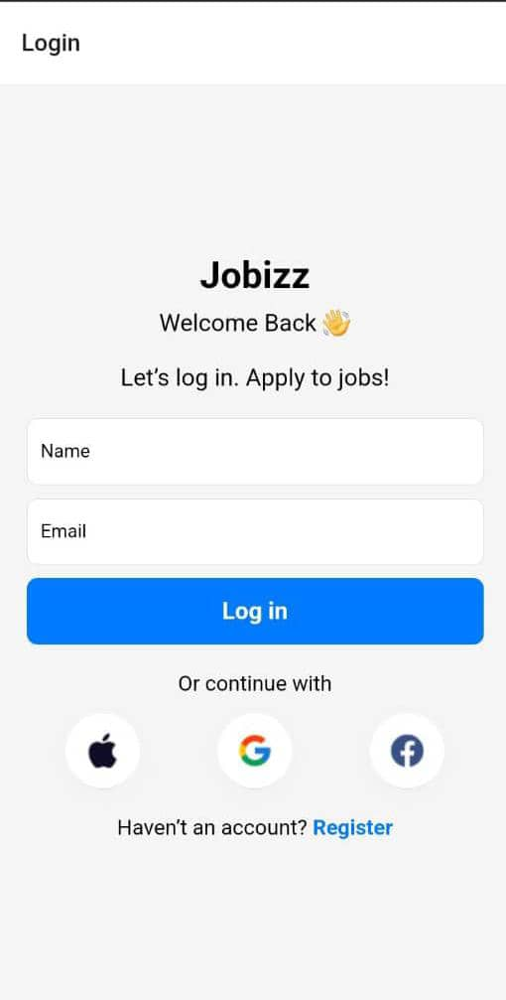
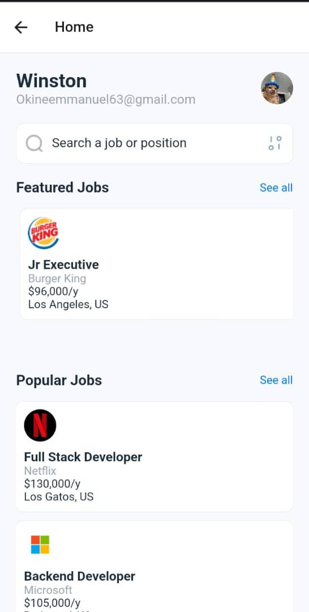

# rn-assignment4-11128803
markdown
Copy code
# Jobizz App

Jobizz is a mobile application designed to simplify job searching and application processes. Users can log in, view featured and popular job listings, and explore detailed job descriptions. This README provides an overview of the app's key components, functionality, installation instructions, usage guidelines, and more.

---

## Screenshots

---

## Features

- *User Authentication*: Log in securely with your name and email.
- *Explore Jobs*: View featured and popular job listings.
- *Search Functionality*: Easily search for specific job titles or keywords.
- *Custom Job Cards*: Detailed cards for each job listing with title, company, salary, and location.

---

## Getting Started

To get a local copy up and running follow these steps:

### Prerequisites

Make sure you have the following installed:

- Node.js
- Expo CLI (for running React Native apps)

### Installation

1. Clone the repo:

  - git clone 'https://github.com/winstonokine/rn-assignment4-11128803'
  - cd jobizz-app

2. Install dependencies:
*npm install*
*or*
  *yarn install*

3. Start the development server:
*npm start*
   *or*
*yarn start*

4.Use the Expo client to open the app on your preferred mobile emulator or device.
